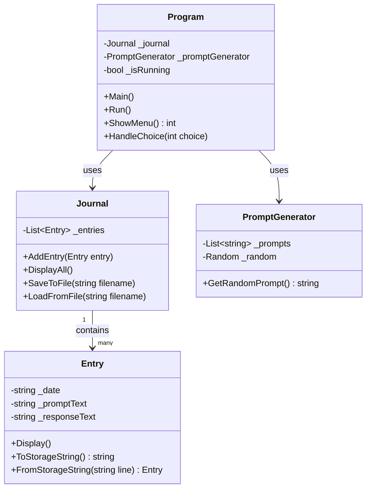
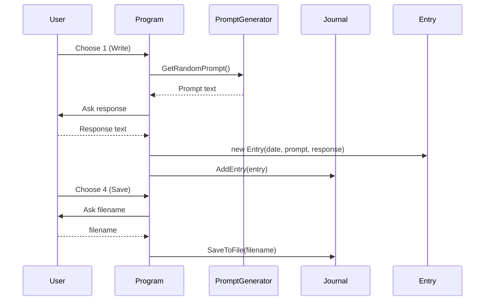
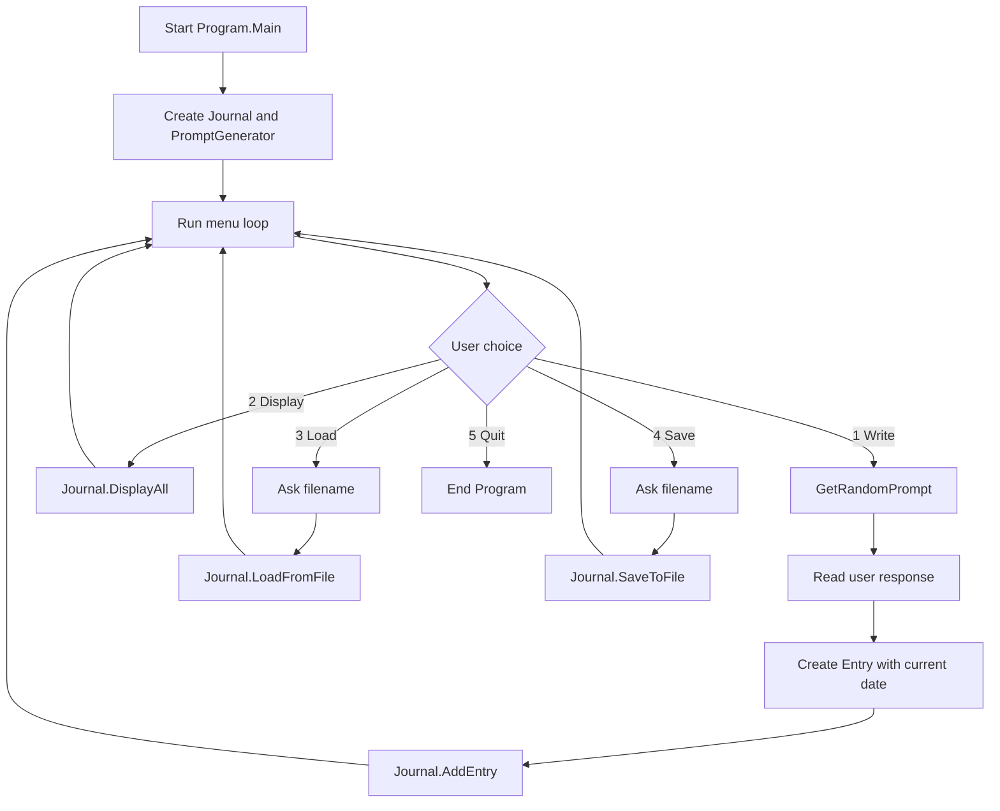

# Journal Program Design (CSE 210)

## 1) Program Specification Summary

### What the program does
The program helps the user keep a journal by writing entries from random prompts, displaying entries, saving entries to a file, and loading entries from a file.

### User inputs
- Menu choice (`1-5`):
  - `1` Write
  - `2` Display
  - `3` Load
  - `4` Save
  - `5` Quit
- Written response to a prompt when creating an entry
- Filename for load/save

### Program output
- Menu text and prompts
- Confirmation/error messages for load/save
- Displayed journal entries

### How the program ends
The program ends when the user selects `5` (Quit).

---

## 2) Classes and Responsibilities

### `Program`
- Starts and controls the app loop
- Shows menu and reads user choices
- Coordinates interactions among classes

### `Journal`
- Owns a collection of `Entry` objects
- Adds entries to memory
- Displays all entries
- Saves and loads entries

### `Entry`
- Represents one journal entry
- Stores date, prompt, and response
- Formats/parses itself for file storage

### `PromptGenerator`
- Stores prompt options
- Returns one random prompt for writing

---

## 3) Behaviors (Methods)

### `Program` behaviors
- `Main()`: application entry point; creates objects and calls `Run()`.
- `Run()`: main loop that keeps asking for menu choices until quit.
- `ShowMenu(): int`: prints the menu and returns selected option.
- `HandleChoice(int choice)`: routes user choice to write/display/load/save/quit logic.

### `Journal` behaviors
- `AddEntry(Entry entry)`: appends a new entry to `_entries`.
- `DisplayAll()`: prints each entry in readable format.
- `SaveToFile(string filename)`: writes entries to disk.
- `LoadFromFile(string filename)`: reads entries from disk and rebuilds `_entries`.

### `Entry` behaviors
- `Display()`: prints one entry in readable form (date, prompt, response).
- `ToStorageString(): string`: converts entry to single line for file writing.
- `static FromStorageString(string line): Entry`: parses one file line into an `Entry`.

### `PromptGenerator` behaviors
- `GetRandomPrompt(): string`: returns one random prompt from `_prompts`.

---

## 4) Attributes (Member Variables + Types)

### `Program` attributes
- `_journal: Journal`
- `_promptGenerator: PromptGenerator`
- `_isRunning: bool`

### `Journal` attributes
- `_entries: List<Entry>`

### `Entry` attributes
- `_date: string`
- `_promptText: string`
- `_responseText: string`

### `PromptGenerator` attributes
- `_prompts: List<string>`
- `_random: Random`

---

## 5) Saving/Loading Design

### File format
- One entry per line
- Delimiter: pipe character (`|`)
- Example line: `2026-03-04|What made you smile today?|I had dinner with my family.`

### Save process (`Journal.SaveToFile`)
1. Open file for writing (overwrite existing contents).
2. For each `Entry` in `_entries`, call `ToStorageString()`.
3. Write each result as one line.
4. Close file and report success/failure.

### Load process (`Journal.LoadFromFile`)
1. Open file for reading.
2. Clear current `_entries` (or replace with a new list).
3. For each line, call `Entry.FromStorageString(line)`.
4. Add parsed entries to `_entries`.
5. Close file and report success/failure.

---

## 6) Prompt Generation Design

- `PromptGenerator` starts with a fixed list of prompt strings.
- `GetRandomPrompt()` picks random index `0` to `_prompts.Count - 1`.
- Returned prompt is shown before user enters response.

Example prompts:
- "What was the best part of your day?"
- "Who was the most interesting person you interacted with today?"
- "What is one thing you learned today?"

---

## 7) UML Class Diagram

---

## 8) Interaction Diagram (How Methods Work Together)

---

## 9) Rubric Coverage Checklist

- Classes: class diagram includes `Program`, `Journal`, `Entry`, `PromptGenerator`.
- Journal - Behaviors: `AddEntry`, `DisplayAll`, `SaveToFile`, `LoadFromFile`.
- Journal - Attributes: `_entries`.
- Entry - Behaviors: `Display`, `ToStorageString`, `FromStorageString`.
- Entry - Attributes: `_date`, `_promptText`, `_responseText`.
- Saving/Loading: file format and save/load step-by-step process defined.
- Prompt Generation: `PromptGenerator` list + random selection behavior defined.
- Interaction: sequence diagram and flowchart both included.

---

## 10) Quick Trace Example

1. User chooses `1` (Write).
2. Program asks `PromptGenerator` for a prompt.
3. User types response.
4. Program creates `Entry(date, prompt, response)`.
5. Program calls `Journal.AddEntry(entry)`.
6. User chooses `4` (Save), enters `myjournal.txt`.
7. Program calls `Journal.SaveToFile("myjournal.txt")`.
8. User chooses `5` (Quit), program ends.
